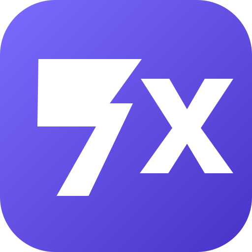
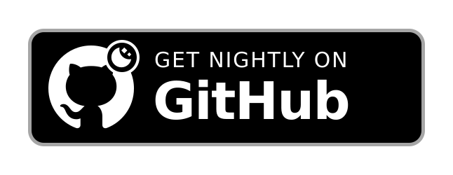

# 7xTune

### Your music, your rhythm.

An Android music player built around YouTube Music, with discovery, a personal library, synced lyrics, and a customizable listening experience.

 

 

[**Download 7xTune**](#download) · [**Features**](#features) · [**Screenshots**](#screenshots) · [**FAQ**](#faq) · [**Get help**](#support)

> [!NOTE]
> 7xTune is an independently maintained project built on the open-source Metrolist codebase. It adds its own identity and user-facing experience while preserving required upstream notices and third-party attributions. See the project history and acknowledgements below for credit.

> [!WARNING]
> **Regional availability:** YouTube Music availability depends on your region. In unsupported regions, access may require a VPN or proxy connected to a supported region.

---

<h1>Screenshots</h1>

---

## Features

<table>
  <tr>
    <td width="50%" valign="top">

### Playback
- Stream music and videos from YouTube Music
- Background playback
- Download and cache supported media for offline listening
- Skip silence and use a sleep timer

</td>
    <td width="50%" valign="top">

### Audio
- Audio normalization
- Tempo and pitch controls
- Equalizer
- Crossfade

</td>
  </tr>
  <tr>
    <td width="50%" valign="top">

### Lyrics & discovery
- Live synced lyrics
- Lyrics translation
- Personalized quick picks
- Pulse, a swipe-based music discovery experience
- Search songs, albums, artists, videos, and playlists

</td>
    <td width="50%" valign="top">

### Library
- Manage your music library
- Create local playlists and import playlists
- Reorder songs in playlists and the queue
- Sign in to YouTube Music to sync supported library content

</td>
  </tr>
  <tr>
    <td width="50%" valign="top">

### Social
- Listen Together with friends in real time
- Last.fm scrobbling
- Discord Rich Presence

</td>
    <td width="50%" valign="top">

### Personalization
- Home screen widget
- Light, dark, black, and dynamic theme modes
- Dynamic color and preset color palettes
- Material 3 interface

</td>
  </tr>
</table>

---

<h1>Download 7xTune</h1>

Get official 7xTune builds from the project's GitHub Releases page.

Check each release's notes and artifacts before installing. Nightly builds may be less stable than tagged releases.

---

<h1>FAQ</h1>

### Is 7xTune affiliated with YouTube or Google?

No. 7xTune is an independent, community-built project and is not affiliated with or endorsed by YouTube, Google, or their affiliates.

### Why might playback be unavailable in my region?

YouTube Music is not available everywhere. Availability depends on the service and your region; a VPN or proxy may be needed where the service is unsupported.

### Where can I report a bug or request an improvement?

Please [open an issue](https://github.com/RahulExe69/7xTune/issues) and include useful reproduction steps, your app version, and relevant logs. Do not post passwords, tokens, or other private account information.

### Where can I find releases and updates?

Use the [GitHub Releases page](https://github.com/RahulExe69/7xTune/releases) for available builds and release notes.

---

<h1>Support & community</h1>

For help, bug reports, or feature discussions, visit the [7xTune repository](https://github.com/RahulExe69/7xTune) or [open an issue](https://github.com/RahulExe69/7xTune/issues).

---

## Acknowledgements

7xTune builds on the open-source **Metrolist** project and its upstream dependencies. We are grateful to the original authors, maintainers, and contributors whose work makes this project possible.

- **Metrolist** — upstream project and codebase: [MetrolistGroup](https://github.com/MetrolistGroup)
- **InnerTune** — [Zion Huang](https://github.com/z-huang) and [Malopieds](https://github.com/Malopieds)
- **OuterTune** — [Davide Garberi](https://github.com/DD3Boh) and [Michael Zh](https://github.com/mikooomich)
- **Better Lyrics** — synced lyrics integration: [better-lyrics.boidu.dev](https://better-lyrics.boidu.dev)
- **metroserver** — real-time Listen Together backend: [GitHub repository](https://github.com/MetrolistGroup/metroserver)
- **MusicRecognizer** — music recognition integration: [GitHub repository](https://github.com/aleksey-saenko/MusicRecognizer)
- **zemer-cipher** — YouTube cipher and PoToken-related integration: [GitHub repository](https://github.com/ZemerTeam/zemer-cipher)

We also thank all third-party library authors, translators, testers, and open-source contributors.

### Translations

Translations currently use the upstream Metrolist Weblate project. Contributions there may improve shared upstream strings, but the project is not a dedicated 7xTune translation space.

- [Upstream translation project](https://hosted.weblate.org/projects/Metrolist/)
- [Upstream translation status](https://hosted.weblate.org/engage/metrolist/)

### Contributors

---

## Licensing & disclaimer

7xTune is an independent project and is **not affiliated with, funded by, authorized by, or endorsed by** YouTube, Google LLC, Metrolist Group, or their affiliates.

YouTube, YouTube Music, Google, and other third-party names and marks belong to their respective owners. The project includes work from Metrolist and other open-source projects; their copyright notices, licenses, and attribution requirements remain applicable. See [LICENSE](LICENSE) and the relevant third-party notices in the repository.

---

**Built independently as 7xTune, with respect for the open-source projects it builds upon.**

